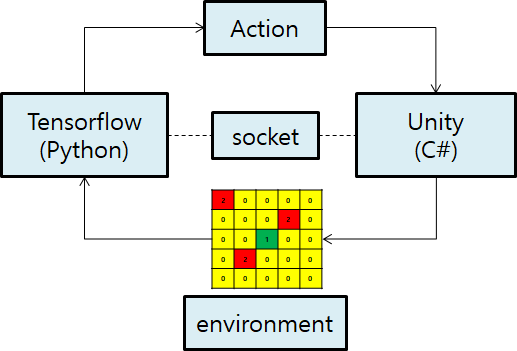

# Unity_TensorFlow_Survival_Shooter
## 버전
- Unity Version 2017.3.1f1

- Python3.6

- Tensorflow 1.6.0

## 설명

- 캐릭터 주변에 적과 장애물을 인지할 수 있는 그리드를 만들었다.

- 캐릭터는 1번 적은2번 장애물은 3번 없으면 0번으로 정의하였다.

- Unity(C#)와 Tensorflow(Python)는 소켓통신으로 데이터를 주고 받았다.

- Unity가 정보를 주면 Tensorflow는 정보를 받아 액션을 준다.

- 액션을 받은 Unity는 Reward를 측정하고 저장해둔다.

- 캐릭터가 사망하였을경우 모아둔 정보들을 Tensorflow에 보내서 Train을 하게 한다.

- 네트워크는 CNN 2계층과 FC 2계층을 사용하였다.
## 영상

